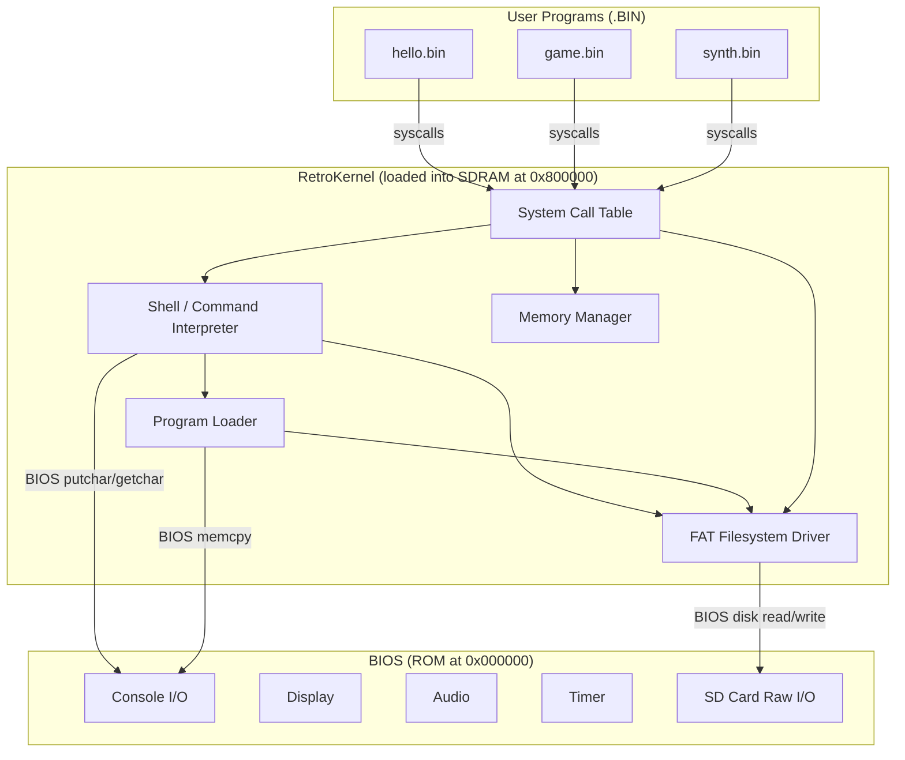
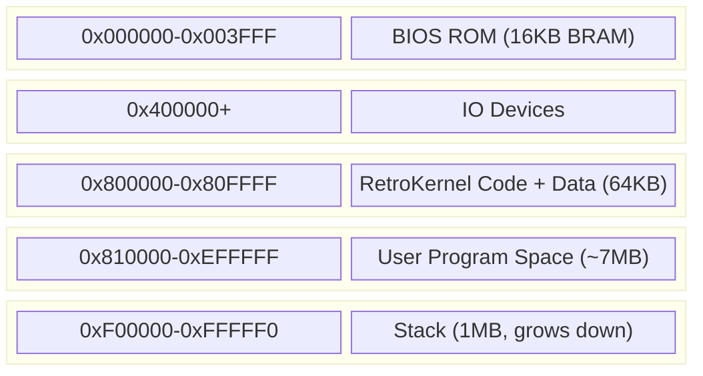
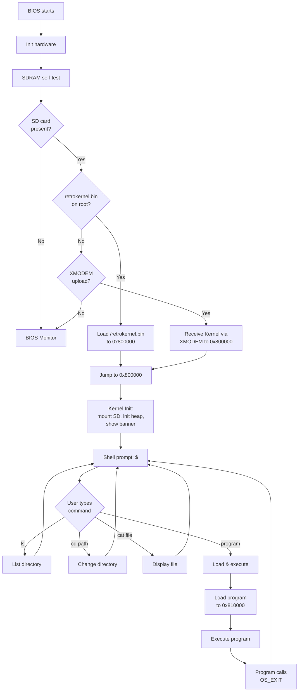
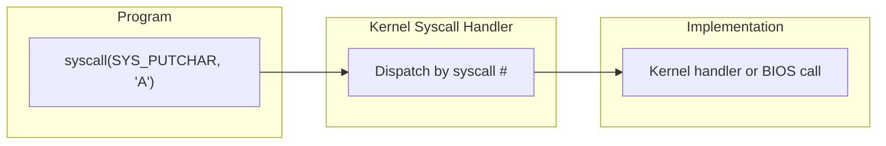
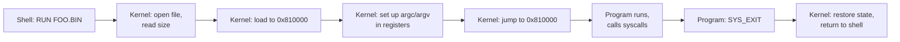

# RetroKernel Specification v0.1

## Overview

A minimal kernel for the retro co-processor platform. Three layers:

- **BIOS** — hardware-specific AND CPU-specific. One per board.
- **Kernel** — CPU-specific but hardware-independent. One per CPU architecture (RISC-V, 68k, etc.). Same binary across all boards with the same CPU.
- **Apps** — run on any system with the kernel. Call kernel syscalls, never touch hardware directly.

The kernel is loaded from SD card (`/retrokernel.bin`) or serial into SDRAM by the BIOS. It provides a Unix-style shell, FAT filesystem, program loading, and hardware abstraction through BIOS calls.



---

## Memory Layout



| Region | Address | Size | Contents |
|--------|---------|------|----------|
| BIOS ROM | 0x000000-0x003FFF | 16KB | Boot ROM, BIOS jump table, monitor |
| IO | 0x400000+ | - | GPU, Synth, UART, Timer, PS2, SD |
| Kernel Code | 0x800000-0x807FFF | 32KB | RetroKernel executable |
| Kernel Data | 0x808000-0x80FFFF | 32KB | kernel heap, buffers, file tables |
| Programs | 0x810000-0xEFFFFF | ~7MB | Loaded user programs |
| Stack | 0xF00000-0xFFFFF0 | 1MB | System + program stack |

---

## Boot Flow



---

## Shell Commands

### Built-in Commands

| Command | Usage | Description |
|---------|-------|-------------|
| `ls` | `ls [path]` | List directory contents |
| `cd` | `cd <path>` | Change current directory |
| `cat` | `cat <file>` | Display file contents |
| `cp` | `cp <src> <dst>` | Copy file |
| `rm` | `rm <file>` | Delete file |
| `mv` | `mv <old> <new>` | Move/rename file |
| `mkdir` | `mkdir <dir>` | Create directory |
| `pwd` | `pwd` | Print working directory |
| `mem` | `mem` | Show memory usage |
| `clear` | `clear` | Clear screen |
| `ver` | `ver` | Show Kernel version |
| `help` | `help` | List commands |
| `load` | `load [addr]` | Receive file via XMODEM |
| `play` | `play <file>` | Play a music/sound file |
| `mode` | `mode 40\|80` | Set display columns |
| `color` | `color <fg> <bg>` | Set text colors |
| `reboot` | `reboot` | Warm reboot to BIOS |
| `echo` | `echo <text>` | Print text |
| `hexdump` | `hexdump <file> [n]` | Hex dump first n bytes |

### Running Programs

Programs are executed by name (with or without `.bin` extension). The shell searches the current directory, then `/bin`:
```
$ hello
$ games/tetris
$ /bin/synth
```

---

## System Call Interface

Programs communicate with the kernel through a system call table at a fixed address. On RISC-V, syscalls use `ecall` or a call to the table.



### Syscall Mechanism

```c
// Program calls Kernel via fixed address jump table at 0x800000
// Register convention:
//   a7 = syscall number
//   a0-a3 = arguments
//   a0 = return value

#define SYSCALL_TABLE  0x800000
#define OS_CALL(n, ...) // macro to invoke syscall n
```

### Syscall Numbers

#### Process (0x00-0x0F)

| # | Name | Args | Returns | Description |
|---|------|------|---------|-------------|
| 0x00 | SYS_EXIT | a0=exit_code | - | Exit program, return to shell |
| 0x01 | SYS_EXEC | a0=*path | a0=status | Load and execute program |
| 0x02 | SYS_GETARG | a0=*buf, a1=maxlen | a0=len | Get command line arguments |

#### Console I/O (0x10-0x1F)

| # | Name | Args | Returns | Description |
|---|------|------|---------|-------------|
| 0x10 | SYS_PUTCHAR | a0=char | - | Write character to console |
| 0x11 | SYS_GETCHAR | - | a0=char | Read character (blocking) |
| 0x12 | SYS_PUTS | a0=*string | - | Print string |
| 0x13 | SYS_GETS | a0=*buf, a1=max | a0=len | Read line with editing |
| 0x14 | SYS_KBHIT | - | a0=0/1 | Check if key available |
| 0x15 | SYS_SET_COLOR | a0=fg, a1=bg | - | Set text colors |
| 0x16 | SYS_CLS | - | - | Clear screen |
| 0x17 | SYS_SET_CURSOR | a0=row, a1=col | - | Position cursor |
| 0x18 | SYS_PRINTF | a0=*fmt, a1-a3=args | - | Formatted print (limited) |

#### File I/O (0x20-0x2F)

| # | Name | Args | Returns | Description |
|---|------|------|---------|-------------|
| 0x20 | SYS_OPEN | a0=*path, a1=mode | a0=fd (-1=error) | Open file |
| 0x21 | SYS_CLOSE | a0=fd | a0=status | Close file |
| 0x22 | SYS_READ | a0=fd, a1=*buf, a2=len | a0=bytes_read | Read from file |
| 0x23 | SYS_WRITE | a0=fd, a1=*buf, a2=len | a0=bytes_written | Write to file |
| 0x24 | SYS_SEEK | a0=fd, a1=offset, a2=whence | a0=position | Seek in file |
| 0x25 | SYS_STAT | a0=*path, a1=*stat | a0=status | Get file info |
| 0x26 | SYS_OPENDIR | a0=*path | a0=handle | Open directory |
| 0x27 | SYS_READDIR | a0=handle, a1=*entry | a0=status | Read next dir entry |
| 0x28 | SYS_CLOSEDIR | a0=handle | - | Close directory |
| 0x29 | SYS_CHDIR | a0=*path | a0=status | Change directory |
| 0x2A | SYS_GETCWD | a0=*buf, a1=maxlen | a0=len | Get current directory |
| 0x2B | SYS_UNLINK | a0=*path | a0=status | Delete file |
| 0x2C | SYS_RENAME | a0=*old, a1=*new | a0=status | Rename file |

#### Memory (0x30-0x3F)

| # | Name | Args | Returns | Description |
|---|------|------|---------|-------------|
| 0x30 | SYS_MALLOC | a0=size | a0=*ptr (0=fail) | Allocate memory |
| 0x31 | SYS_FREE | a0=*ptr | - | Free memory |
| 0x32 | SYS_MEMINFO | - | a0=total, a1=free | Memory statistics |

#### Audio (0x40-0x4F)

| # | Name | Args | Returns | Description |
|---|------|------|---------|-------------|
| 0x40 | SYS_NOTE_ON | a0=voice, a1=note, a2=vel | - | Play note |
| 0x41 | SYS_NOTE_OFF | a0=voice | - | Stop note |
| 0x42 | SYS_SET_INSTR | a0=voice, a1=preset | - | Set instrument |
| 0x43 | SYS_ALL_OFF | - | - | Silence all |

#### Graphics (0x50-0x5F)

| # | Name | Args | Returns | Description |
|---|------|------|---------|-------------|
| 0x50 | SYS_GFX_MODE | a0=mode | - | Set graphics mode |
| 0x51 | SYS_GFX_PIXEL | a0=x, a1=y, a2=color | - | Set pixel |
| 0x52 | SYS_GFX_RECT | a0=x, a1=y, a2=w, a3=h | - | Fill rectangle (color in stack) |
| 0x53 | SYS_GFX_PALETTE | a0=idx, a1=rgb | - | Set palette |
| 0x54 | SYS_VBLANK | - | - | Wait for VBlank |

#### Timer (0x60-0x6F)

| # | Name | Args | Returns | Description |
|---|------|------|---------|-------------|
| 0x60 | SYS_TICKS | - | a0=ms | Milliseconds since boot |
| 0x61 | SYS_DELAY | a0=ms | - | Blocking delay |

---

## File Descriptors

The Kernel supports up to 8 simultaneously open files:

| FD | Default | Description |
|----|---------|-------------|
| 0 | stdin | Console input (keyboard) |
| 1 | stdout | Console output (GPU + UART) |
| 2 | stderr | Error output (GPU + UART) |
| 3-7 | - | Available for file I/O |

---

## Directory Entry Structure

```c
struct os_dirent {
    char     name[13];      // 8.3 filename, null-terminated
    uint8_t  attr;           // File attributes (R/H/S/D/A)
    uint32_t size;           // File size in bytes
    uint16_t date;           // Last modified date (FAT format)
    uint16_t time;           // Last modified time (FAT format)
};
```

---

## Program Binary Format

Programs are flat binaries (.BIN) loaded at 0x810000 and executed:



### Program Requirements
- Linked at address 0x810000 (using upload_sdram.ld or similar)
- Entry point is the first instruction
- Can use all syscalls via the kernel call table
- Must call SYS_EXIT to return cleanly
- Stack is pre-set by the kernel (top of SDRAM)
- `gp` register points to IO_BASE (0x400000)

### Passing Arguments
```c
// Kernel sets before calling program:
//   a0 = argc (argument count)
//   a1 = argv (pointer to argument string array in SDRAM)
int main(int argc, char **argv) {
    // argv[0] = program name
    // argv[1..] = command line arguments
}
```

---

## Kernel Internal Structure

```c
// os.c - Main kernel source file structure

// ---- Data structures ----
struct os_state {
    char     cwd[128];          // Current working directory
    uint8_t  open_files;        // Bitmask of open file descriptors
    void    *file_handles[8];   // FAT library file handles
    uint32_t heap_start;        // Start of heap (after Kernel data)
    uint32_t heap_end;          // Current end of heap
    uint32_t ticks;             // System tick counter
};

// ---- Syscall dispatch table ----
typedef int (*syscall_fn)(int a0, int a1, int a2, int a3);
syscall_fn syscall_table[128];

// ---- Initialization ----
void os_init(void);             // Called by BIOS after load
void os_mount_sd(void);         // Mount SD card filesystem
void os_init_heap(void);        // Set up memory allocator

// ---- Shell ----
void shell_loop(void);          // Main command loop
void shell_exec_cmd(char *line);// Parse and execute command
int  shell_run_program(char *path, char *args);

// ---- File system wrappers ----
int  os_open(const char *path, int mode);
int  os_read(int fd, void *buf, int len);
int  os_write(int fd, const void *buf, int len);
int  os_close(int fd);

// ---- Memory manager ----
void *os_malloc(uint32_t size);
void  os_free(void *ptr);
```

---

## Implementation Phases

```mermaid
gantt
    title RetroKernel Implementation
    dateFormat X
    axisFormat %s

    section Phase 1: Boot + Shell
    kernel entry point + init          :p1a, 0, 1
    Syscall table + dispatcher     :p1b, 0, 1
    Shell command loop             :p1c, 1, 2
    ls / cd / clear / mem / ver    :p1d, 1, 2
    Program loader (BIN from SD)   :p1e, 2, 3

    section Phase 2: File I/O
    FAT filesystem integration     :p2a, 3, 4
    open / read / write / close    :p2b, 3, 4
    cat / cp / rm / mv             :p2c, 4, 5
    File descriptor management     :p2d, 4, 5

    section Phase 3: Rich Features
    Memory allocator (malloc/free) :p3a, 5, 6
    Command line arguments         :p3b, 5, 6
    Audio / graphics syscalls      :p3c, 6, 7
    Autoexec script on boot        :p3d, 6, 7
```



### Phase 1: Boot + Shell (current priority)
**Goal:** Boot from SD card, show shell prompt, list files, run programs.

Files:
- `os_main.c` — entry point, init, shell loop
- `os_syscall.c` — syscall table and dispatcher
- `os_shell.c` — command parser and built-in commands
- `os_loader.c` — load .BIN from filesystem, set up and execute

### Phase 2: File I/O
**Goal:** Full file read/write from programs via syscalls.

Files:
- `os_file.c` — file descriptor management, open/read/write/close
- `os_fs.c` — FAT filesystem wrappers around fat_io_lib

### Phase 3: Rich Features
**Goal:** Memory management, arguments, audio/graphics, scripting.

Files:
- `os_mem.c` — simple heap allocator
- `os_audio.c` — synth syscall wrappers
- `os_gfx.c` — graphics mode syscalls

---

## Build System

```
FemtoRV/FIRMWARE/retrokernel/
  Makefile          # Build kernel binary
  os_main.c         # Entry point, init
  os_syscall.c      # Syscall dispatcher
  os_shell.c        # Shell commands
  os_loader.c       # Program loader
  os_file.c         # File I/O
  os.h              # kernel internal headers
  retrokernel.ld        # Linker script (origin 0x800000)

Output: retrokernel.bin  (copied to SD card root as /retrokernel.bin)
```

### BIOS Boot Loader
The BIOS needs a minimal read-only FAT16/FAT32 reader (~2KB) to find and load `/retrokernel.bin` from the SD card root. This is a stripped-down single-file loader in ROM — the full read/write FAT library lives in the kernel itself.

### Design Principles
- **ROM is minimal** — only hardware init, boot loader, and BIOS jump table. All policy lives in the kernel.
- **kernel is hardware-agnostic** — never touches IO registers directly. All hardware access goes through BIOS syscalls. This allows the same kernel binary to run on different CPU architectures with different BIOS implementations.
- **Single root filesystem** — SD card mounts as `/`. No drive letters. Unix-style paths with `/` separators.
- **Full FAT16/FAT32 support** — read and write, long filenames, subdirectories. Provided by the kernel, not the BIOS.

---

## Example Session

```
RetroKernel v0.1 - FemtoRV @ 25MHz
8MB SDRAM, SD card mounted
Type 'help' for commands

/$ ls
retrokernel.bin    32768  2026-03-31
hello.bin       4096  2026-03-31
bounce.bin      4804  2026-03-31
mario.bin       3364  2026-03-31
games/
readme.txt      1024  2026-03-31
5 file(s), 1 dir(s), 7980432 bytes free

/$ cat readme.txt
Welcome to RetroKernel!
This is the FemtoRV retro co-processor.

/$ hello
Hello from SDRAM!
exit(0)

/$ cd games
/games$ ls
tetris.bin     12800  2026-03-31
snake.bin       8192  2026-03-31
2 file(s), 0 dir(s)

/games$ tetris
[Tetris game runs, press ESC to exit]
exit(0)

/games$ cd /
/$ reboot
Rebooting...
```
